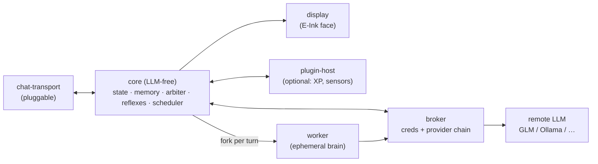

  

# shelldon

> An E-Ink AI pet for the Raspberry Pi Zero 2W — chat-first, remote-LLM brain, a face that lives on your desk.

`shelldon` is a ground-up v2 rebuild of [openclawgotchi](https://github.com/) (MIT, by Dmitry Turmyshev). At its core it's a **chat-bot pet**: you converse with a remote-LLM brain by text, over a **pluggable chat transport** (not hardcoded to any one service), while the pet's face and mood live on a Waveshare E-Ink screen. It's built to be genuinely *owned* — a clean, tested spine that designs out v1's documented pains.

## Status

🟡 **Planning complete — implementation not started.**

The full planning chain is done and self-consistent:

| Artifact | Path |
|---|---|
| Spec (the contract — 11 capabilities) | [`SPEC.md`](_bmad-output/specs/spec-openclawgotchi-v2/SPEC.md) |
| Architecture spine (15 decisions) | [`ARCHITECTURE-SPINE.md`](_bmad-output/planning-artifacts/architecture/architecture-shelldon-2026-06-15/ARCHITECTURE-SPINE.md) |
| Epics & stories (7 epics) | [`epics.md`](_bmad-output/planning-artifacts/epics.md) |

## What makes it different from v1

- **Memory-safe by design.** Ephemeral per-turn workers (fork-server + copy-on-write) spawn, run one turn, and die — so RAM never accumulates. v1's OOM crashes are the defining failure being engineered out.
- **One security boundary.** A single capability broker is the sole holder of model/tool credentials and the only egress to the LLM.
- **Pluggable everything.** The chat transport, the LLM provider (default GLM, with fallback to Ollama/Gemini/OpenAI/OpenRouter), and peripherals are all adapters — none welded into the core.
- **It feels alive.** Resident reflexes (blink, idle, mood drift) run between turns, and an autonomous scheduler lets it act on its own — within a battery + credit budget.
- **It learns.** Light self-improving memory: notable things are captured during conversation and consolidated into durable memory during scheduled "dream cycles."

## Architecture at a glance

A multi-process **actor model** over a typed message bus, around a hexagonal **LLM-free core**.

Everything talks over an Envelope bus (Unix domain sockets); `core/` is mechanically barred from importing LLM code. Memory is hybrid — sqlite for conversation history, a human-readable markdown tree for curated knowledge.

## Hardware

- [Raspberry Pi Zero 2W (~512MB RAM)](https://amzn.to/3QN8Pk6)
- [Waveshare V4 E-Ink display](https://amzn.to/4exgDi1)
- [PiSugar2 battery HAT (power + button)](https://amzn.to/4vh59WZ)
- [SANDISK 32GB High Endurance microSDHC](https://amzn.to/4vRh6lW)

Sensors and other peripherals are **optional**, added as plugins.

_Disclaimer: Amazon Affiliate Links to help me out with development_

## Roadmap

**Daily-driver line** — Epics 1–4 (+ the endurance soak) are the version that lives on the desk every day. Epics 5–7 are enrichment, added when wanted.

- [ ] **Epic 1 — Talking Pet** (walking skeleton: chat turn end-to-end + face + endurance soak) ⭐ daily-driver
- [ ] **Epic 2 — Resilient Brain** (provider fallback, degrade-to-reflex) ⭐ daily-driver
- [ ] **Epic 3 — A Pet That Feels Alive** (reflexes, mood, expressive face) ⭐ daily-driver
- [ ] **Epic 4 — Memory & Continuity** (conversation history + curated memory + owner directive) ⭐ daily-driver
- [ ] **Epic 5 — Autonomous Life** (scheduler, proactive action, battery-aware) — enrichment
- [ ] **Epic 6 — Dreaming & Learning** (capture + consolidate) — enrichment
- [ ] **Epic 7 — Extensibility & Optional Embodiment** (plugins, XP, sensors) — enrichment

## Credits

Built on the ideas of **openclawgotchi** by **Dmitry Turmyshev** (MIT). `shelldon` is a clean-room reimplementation — v1 is studied as reference, never copied.

## License

[MIT](LICENSE) — see also `NOTICE` for attribution.
