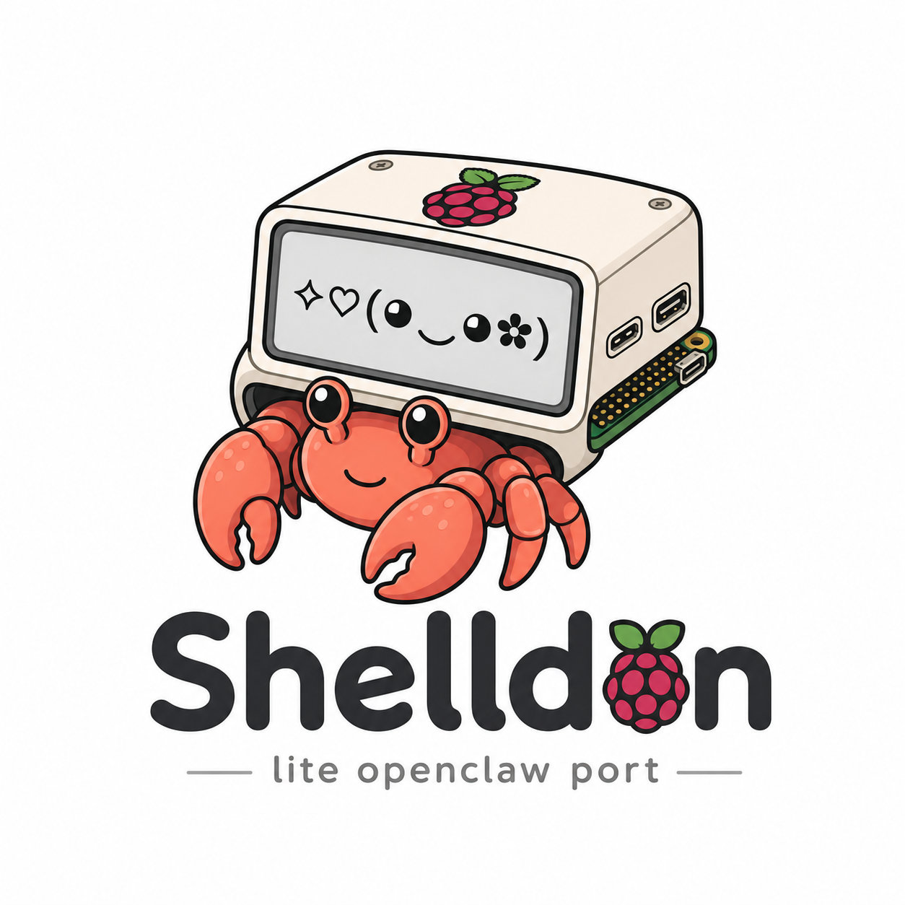
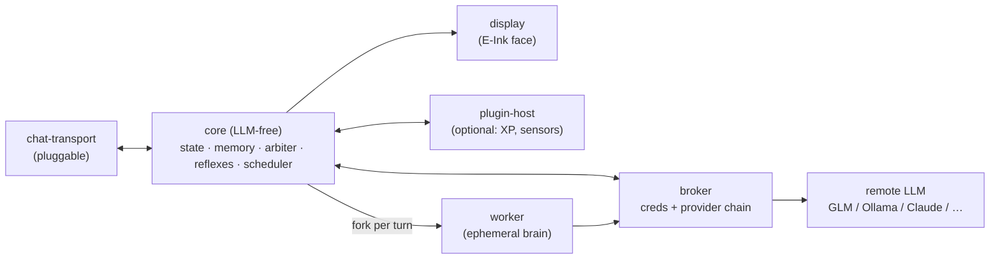

<p align="center">
  
</p>

# shelldon

> An E-Ink AI pet for the Raspberry Pi Zero 2W — chat-first, remote-LLM brain, a face that lives on your desk.

## What is it?

shelldon is a tiny AI pet you **talk to** — a little face on a screen that talks back. Think Tamagotchi, but the brain is a real AI.

**What it does:**

- 💬 **Chats with you** — type to it, it replies with a genuine LLM brain
- 😊 **Has a face and moods** — an expressive E-Ink face that shifts with how it feels and what's happening
- 🧠 **Remembers you** — it builds up memory of who you are and what you've talked about
- 🌱 **Learns over time** — jots down what matters as you talk, then in a *dream cycle* consolidates the durable bits into lasting memory and lets the rest go
- 👋 **Acts on its own** — reaches out with a thought when you've been quiet a while, bounded by a daily budget and battery state so it never spams or overspends
- 🫧 **Feels alive** — blinks, idles, and drifts in mood between chats, even when you're not around
- 🪶 **Runs anywhere** — fully in your terminal (zero hardware) *or* on a palm-sized Raspberry Pi with a screen

**No subscription needed.** Point it at a free AI provider and it costs **$0/month** to run — or a few dollars for a fancier brain. [Jump to costs ↓](#cost-of-running-it)

That's the gist. Everything below is the *how* and *why*.

---

## Origins

`shelldon` is a ground-up v2 rebuild of [openclawgotchi](https://github.com/turmyshevd/openclawgotchi) (MIT, by [Dmitry Turmyshev](https://github.com/turmyshevd)). At its core it's a **chat-bot pet**: you converse with a remote-LLM brain by text, over a **pluggable chat transport** (not hardcoded to any one service), while the pet's face and mood live on a Waveshare E-Ink screen. It's built to be genuinely *owned* — a clean, tested spine that engineers out v1's documented pains.

It sits at the end of a short but meaningful lineage.

**[pwnagotchi](https://pwnagotchi.ai/)** (by [@evilsocket](https://github.com/evilsocket)) pioneered the form factor: an E-Ink "virtual pet" on a Pi Zero that *feels alive*. It showed that a small, cheap piece of hardware with a face on it could become a companion object — something you put on your desk and check in on. Two things come directly from pwnagotchi's design: the **expressive E-Ink face** (expressions that shift with mood and activity, idle animations between events) and the **XP leveling system** (the pet grows and levels up through interaction, giving the relationship a sense of progression over time). Both of those are being brought forward into shelldon.

**[openclawgotchi](https://github.com/turmyshevd/openclawgotchi)** (by Dmitry Turmyshev) took that same form factor and made it a chat pet — connecting the E-Ink face to an LLM brain via Telegram. The Tamagotchi-meets-AI idea is genuinely compelling. But v1 accumulated real operational pain: OOM crashes on the Pi Zero's 512MB of RAM, a 1513-line Telegram connector with safety logic scattered through it, zero test coverage, and a transport hardcoded to one service.

**`shelldon`** is the v2 rebuild: same spirit, different spine. Clean-room — v1 code is studied as reference, never copied.

## What makes it different

### vs. openclawgotchi (v1)

| v1 pain | shelldon solution |
|---|---|
| **OOM crashes** on Pi Zero's 512MB | **Ephemeral fork-server workers** — each turn forks a worker that runs once and dies; RAM never accumulates across turns |
| **Hardcoded Telegram** — one transport, all safety woven into a single massive connector | **Transport-agnostic adapter contract** — CLI, Telegram, SMS, or anything else slots in; none wired into core |
| **Zero tests** — bugs discovered in production | **M0 test harness from day one** — contract round-trips, worker-bound invariant, and atomic-write crash-safety all verified before first feature |
| **Safety scattered** across 1513-line connector | **One security boundary** — a single capability broker is the sole holder of LLM creds; nothing else can call a model |
| **No provider flexibility** | **Pluggable, ordered provider chain** — GLM default, Ollama/OpenAI/OpenRouter fallback, all config — never a code change |
| **No offline life** | **Resident reflexes** (blink, idle, mood drift) run between turns so the pet never freezes when the LLM is busy |


## Philosophy

A few decisions that shape everything:

**Autonomy over convenience.** The project exists because building it is the point — not finding the quickest path to a working bot. Every major component is designed to be understood and owned, not imported-and-forgotten.

**Mechanical invariants beat vigilance.** The LLM-free core isn't a policy — it's enforced by an import-linter in CI. The ≤1-worker-in-flight guarantee isn't a comment — it's tested. The principle: if a constraint matters, make it impossible to break accidentally.

**512MB as a design constraint, not an excuse.** The Pi Zero 2W's memory limit is the load-bearing reason for half the architectural decisions (fork-server workers, RAM-resident personality state, WAL sqlite, atomic markdown writes). Designing around it produces a cleaner system than ignoring it.

**Chat-first, embodiment optional.** The pet's "soul" lives in the conversation — the face and hardware are enrichment, not the point. This means the system works fully in a terminal (CLI transport, no E-Ink) while still scaling up to full hardware.

## Status

🟢 **Deployed and running on real hardware.** shelldon lives on a Raspberry Pi Zero 2W as a systemd service — you text it from your phone (Telegram), it thinks with a live LLM brain, replies, shows its face on the E-Ink panel, remembers you across the conversation, and drifts in mood between chats. Epics 1–8 done.

39 stories shipped, **550 tests passing** (plus opt-in live-provider smokes), zero external runtime deps beyond the LLM SDKs, the LLM-free-core import contract held throughout. **It's not a demo — it runs end-to-end on a 416MB Pi:** a real Telegram message → the fork-server worker assembles a memory-shaped prompt → GLM (via Z.ai) replies → core applies the model's ops (facts written, learnings classified/resolved in sqlite) → the expressive face updates on the panel — with RAM staying flat (the ephemeral fork worker is the whole reason it survives the Pi Zero's memory, the box that OOM-killed its predecessor). It autostarts on boot, restarts on failure, and installs with one script (`deploy/setup-pi.sh`). Verification, hardware bring-up (E-Ink + the real `os.fork()` worker), and the production deployment were all proven on-device. Remaining work is polish (real privilege-drop, physical sensors, partial-refresh animations), not core function.

- **Epic 1 — Talking Pet** ✅ the full walking skeleton end-to-end; an endurance soak proved flat memory over sustained turns.
- **Epic 2 — Resilient Brain** ✅ an ordered provider chain with automatic fallback, degrading gracefully to reflex-only when the whole chain fails.
- **Epic 3 — A Pet That Feels Alive** ✅ persistent personality state, a resident reflex loop (blink/idle/mood drift), and a self-modifiable expressive-face registry.
- **Epic 4 — Memory & Continuity** ✅ sqlite conversation history (WAL/FTS5) + a curated markdown memory tree (sole-writer core, worker proposes), an OS-isolated vault, and memory injected into every prompt so the past shapes the reply.
- **Epic 5 — Autonomous Life** ✅ a core-resident multi-cadence scheduler, a daily credit budget + cooldown, battery-aware backoff, and proactive action — the pet acts on its own, bounded.
- **Epic 6 — Dreaming & Learning** ✅ cheap hot-path learning capture + a scheduled dream cycle that classifies, promotes the durable learnings into memory, and prunes the rest. (Confirmed live: a real GLM dream classified seeded learnings and core applied the promote/prune ops — Epic 8.)
- **Epic 7 — Extensibility & Optional Embodiment** ✅ a generalized plugin model — plugins emit/subscribe events, own private state, and claim display regions, *never importing core* (enforced by import-linter). Exercised by an optional XP/leveling widget, optional physical sensing (PiSugar2 button + BLE pair-first presence), and a bounded plugin→core channel that lets plugin events nudge the pet's mood (so a button press or your arrival visibly moves its face).
- **Epic 8 — Verify & Deploy** ✅ live-LLM verification (a real turn + a real dream against GLM, core applies the ops), then real-hardware deployment: the fork/OOM model proven on the 416MB Pi, a Telegram chat transport, the Waveshare 2.13" E-Ink renderer, and a systemd service + one-shot `setup-pi.sh`. Includes the fix for the fork-not-fork-safe SQLite bug that had cost the pet its short-term memory on-device.

| Artifact | Path |
|---|---|
| Spec (11 capabilities) | [`SPEC.md`](_bmad-output/specs/spec-openclawgotchi-v2/SPEC.md) |
| Architecture spine (15 decisions) | [`ARCHITECTURE-SPINE.md`](_bmad-output/planning-artifacts/architecture/architecture-shelldon-2026-06-15/ARCHITECTURE-SPINE.md) |
| Epics & stories (7 epics) | [`epics.md`](_bmad-output/planning-artifacts/epics.md) |

## Architecture at a glance

A multi-process **actor model** over a typed message bus, around a hexagonal **LLM-free core**.



Everything talks over an Envelope bus (Unix domain sockets); `core/` is mechanically barred from importing LLM code. The broker holds an ordered provider chain — reorder or extend it with a single env-var change, no code. Memory is hybrid — sqlite for conversation history (WAL, FTS5) and a human-readable markdown tree for curated knowledge.

### The provider chain

The broker sits at the only egress to any LLM. It holds an ordered chain of adapters, two wire formats:

- **Anthropic-format** — the `anthropic` SDK, serving both **GLM-4.7 via Z.ai's Anthropic-compatible endpoint** and **native Claude**. One adapter, two endpoints — the only difference is config.
- **OpenAI-compatible** — the `openai` SDK, serving **Ollama-over-LAN**, **OpenAI**, **OpenRouter**, and any OpenAI-compatible endpoint. One adapter reaches the whole free-tier crowd — Groq, Cerebras, Gemini, NVIDIA NIM, Mistral — by config alone (see [Cost of running it](#cost-of-running-it)).

`PROVIDER_CHAIN="glm,ollama"` builds a two-element chain. `glm,groq,openrouter` builds three. An unknown preset fails at startup — no silent degradation.

## Hardware

- [Raspberry Pi Zero 2W (~512MB RAM)](https://amzn.to/3QN8Pk6)
- [Waveshare V4 E-Ink display](https://amzn.to/4exgDi1)
- [PiSugar2 battery HAT (power + button)](https://amzn.to/4vh59WZ)
- [SANDISK 32GB High Endurance microSDHC](https://amzn.to/4vRh6lW)

Sensors and other peripherals are **optional**, added as plugins. The system runs fully in a terminal (CLI transport, no display) — hardware is enrichment.

_Disclaimer: Amazon Affiliate Links to help me out with development_

## Cost of running it

shelldon doesn't run a model on the Pi Zero — it's a thin client that sends prompts to a remote LLM over the network. That means you control the cost entirely.

**Free — local Ollama.** Run a model on any machine with a decent GPU on your LAN and point shelldon at it. `PROVIDER_CHAIN="ollama"` and `OLLAMA_API_BASE=http://<your-machine>:11434` is all the config needed. I run [Qwen](https://github.com/QwenLM/Qwen) on a 3090 — it handles tool calls and vision well, and latency over LAN is negligible. Zero API cost, zero cloud dependency.

**Free — hosted, no credit card.** Several providers offer genuine free tiers (not trials) that renew daily and need no card. All of them speak the **OpenAI-compatible** wire format, so they work today through shelldon's existing `openai` preset — just point `OPENAI_BASE_URL` at them, no code change:

```
PROVIDER_CHAIN="openai"
OPENAI_API_KEY=<your-free-key>
OPENAI_BASE_URL=https://api.groq.com/openai/v1
OPENAI_MODEL=llama-3.3-70b-versatile
```

| Provider | `OPENAI_BASE_URL` | Free tier (June 2026) | Good for |
|---|---|---|---|
| **Gemini** (Google AI Studio) | `https://generativelanguage.googleapis.com/v1beta/openai/` | 1,500 req/day, 1M context | Best free frontier-class model |
| **Groq** | `https://api.groq.com/openai/v1` | ~1,000 req/day, 100K tok/day | Fastest replies (~320 tok/s) |
| **Cerebras** | `https://api.cerebras.ai/v1` | 1M tokens/day | Highest daily volume |
| **OpenRouter** (`:free` models) | `https://openrouter.ai/api/v1` | ~50–1,000 req/day | Variety — DeepSeek R1, Llama 3.3, Qwen3 through one key |
| **NVIDIA NIM** | `https://integrate.api.nvidia.com/v1` | email signup | 100+ open-weight models |
| **Mistral** | `https://api.mistral.ai/v1` | developer free tier | Mistral's own models |

Free-tier quotas are **independent per provider**, so the smart move is to stack them in the chain and let it rotate when one hits a rate limit — e.g. `PROVIDER_CHAIN="glm,groq,cerebras,openrouter"`. (Dedicated one-word presets — `gemini`, `groq`, `cerebras` — are a small planned convenience on top of the generic `openai` preset.) Two caveats: free tiers usually train on your prompts, so keep anything sensitive off them; and providers cut quotas without notice — check live limits.

**Under $20/month — GLM via Z.ai.** [GLM-4.7](https://z.ai) is a capable hosted model with an Anthropic-compatible API, which is why it's shelldon's default provider. Pricing is token-based and in practice lands well under $20/month for a pet that talks with you daily. [Use this link for a discount at signup.](https://z.ai/subscribe?ic=LGN84JDUIC)

## Roadmap

**Daily-driver line** — Epics 1–4 are the version that lives on the desk every day; Epics 5–6 are the autonomy + learning enrichment. **Epics 1–8 are done — shelldon is verified, deployed, and running on a real Pi as a service.** What's left is polish (privilege-drop hardening, physical sensors wired to real hardware, partial-refresh face animations).

- [x] **Epic 1 — Talking Pet** — walking skeleton: chat turn end-to-end, face reacts, endurance soak ✅ (9/9 stories)
- [x] **Epic 2 — Resilient Brain** — provider chain fallback, degrade-to-reflex on chain exhaustion ✅ (3/3 stories) ⭐ daily-driver
- [x] **Epic 3 — A Pet That Feels Alive** — resident reflexes, mood drift, self-modifiable expressive face ✅ (3/3 stories) ⭐ daily-driver
- [x] **Epic 4 — Memory & Continuity** — sqlite conversation history (FTS5) + curated markdown memory + owner directive + OS-isolated vault + memory-shaped prompts ✅ ⭐ daily-driver
- [x] **Epic 5 — Autonomous Life** — multi-cadence scheduler, proactive action, daily credit budget, battery-aware backoff ✅
- [x] **Epic 6 — Dreaming & Learning** — hot-path learning capture + dream-cycle consolidation (classify / promote / prune) ✅
- [x] **Epic 7 — Extensibility & Optional Embodiment** — generalized plugin model, XP widget, optional physical sensing (button/BLE), plugin→core mood-nudge ✅ (6/6 stories) — *optional; the core pet is complete without it*
- [x] **Epic 8 — Verify & Deploy** — live-LLM verification (GLM-4.7 via Z.ai) + real-hardware deployment: fork/OOM proven on the 416MB Pi, Telegram transport, Waveshare E-Ink renderer, systemd service + `setup-pi.sh`, and the fork-SQLite memory fix ✅ — *running on the desk*
- [ ] **Polish** — real worker privilege-drop on the Pi, physical sensors (button/BLE) wired to hardware, partial-refresh face animations, Telegram niceties *(none load-bearing)*

## Credits

Built on the ideas of **[openclawgotchi](https://github.com/turmyshevd/openclawgotchi)** by [Dmitry Turmyshev](https://github.com/turmyshevd) (MIT). `shelldon` is a clean-room reimplementation — v1 is studied as reference, never copied.

Form-factor inspiration from **[pwnagotchi](https://pwnagotchi.ai/)** by [@evilsocket](https://github.com/evilsocket) — the original E-Ink virtual pet on Pi Zero.

## License

[MIT](LICENSE) — see also [NOTICE](NOTICE) for attribution.
