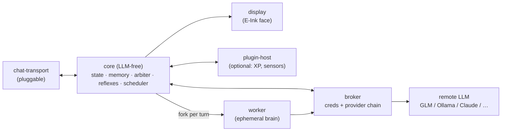

<p align="center">
  
</p>

<p align="center">
  
  <br>
  <em>The real thing: the reacting face, the battery widget, and an on-screen caption — live on the panel.</em>
</p>

# shelldon

> An E-Ink AI pet for the Raspberry Pi Zero 2W — chat-first, remote-LLM brain, a face that lives on your desk.

<p align="center">
  <strong>📖 <a href="https://github.com/elliotboney/shelldon/wiki">Read the Wiki</a></strong> — architecture, how it works, and how to run it on real hardware.
</p>

## What is it?

shelldon is a tiny AI pet you **talk to** — a little face on a screen that talks back. Think Tamagotchi, but the brain is a real AI.

**What it does:**

- 💬 **Chats with you** — type to it, it replies with a genuine LLM brain
- 😊 **Has a face and moods** — an expressive E-Ink face that shifts with how it feels and what's happening
- 🧠 **Remembers you** — it builds up memory of who you are and what you've talked about
- 🌱 **Learns over time** — jots down what matters as you talk, then in a *dream cycle* consolidates the durable bits into lasting memory and lets the rest go
- 🛠️ **Writes its own tools** — missing a capability? it writes a new tool (with a test), runs it past you for one-tap approval, and has that ability for good — [more ↓](#it-writes-its-own-tools)
- 👋 **Acts on its own** — reaches out with a thought when you've been quiet a while, bounded by a daily budget and battery state so it never spams or overspends
- 🫧 **Feels alive** — blinks, idles, and drifts in mood between chats, even when you're not around
- 🪶 **Runs anywhere** — fully in your terminal (zero hardware) *or* on a palm-sized Raspberry Pi with a screen

**No subscription needed.** Point it at a free AI provider and it costs **$0/month** to run — or a few dollars for a fancier brain. [Jump to costs ↓](#cost-of-running-it)

That's the gist. **Want to run it? [Getting started ↓](#getting-started).** Everything else below is the *how* and *why*.

---

## Origins

`shelldon` is a ground-up v2 rebuild of [openclawgotchi](https://github.com/turmyshevd/openclawgotchi) (MIT, by [Dmitry Turmyshev](https://github.com/turmyshevd)). At its core it's a **chat-bot pet**: you converse with a remote-LLM brain by text, over a **pluggable chat transport** (not hardcoded to any one service), while the pet's face and mood live on a Waveshare E-Ink screen. It's built to be genuinely *owned* — a clean, tested spine that engineers out v1's documented pains.

It sits at the end of a short but meaningful lineage.

**[pwnagotchi](https://pwnagotchi.ai/)** (by [@evilsocket](https://github.com/evilsocket)) pioneered the form factor: an E-Ink "virtual pet" on a Pi Zero that *feels alive*. It showed that a small, cheap piece of hardware with a face on it could become a companion object — something you put on your desk and check in on. Two things come directly from pwnagotchi's design: the **expressive E-Ink face** (expressions that shift with mood and activity, idle animations between events) and the **XP leveling system** (the pet grows and levels up through interaction, giving the relationship a sense of progression over time). Both of those are being brought forward into shelldon.

**[openclawgotchi](https://github.com/turmyshevd/openclawgotchi)** (by Dmitry Turmyshev) took that same form factor and made it a chat pet — connecting the E-Ink face to an LLM brain via Telegram. The Tamagotchi-meets-AI idea is genuinely compelling. But v1 accumulated real operational pain: OOM crashes on the Pi Zero's 512MB of RAM, a 1513-line Telegram connector with safety logic scattered through it, zero test coverage, and a transport hardcoded to one service.

**`shelldon`** is the v2 rebuild: same spirit, different spine. Clean-room — v1 code is studied as reference, never copied.

## What makes it different

### vs. openclawgotchi (v1)

| v1 pain | shelldon solution |
|---|---|
| **OOM crashes** on Pi Zero's 512MB | **Ephemeral fork-server workers** — each turn forks a worker that runs once and dies; RAM never accumulates across turns |
| **Hardcoded Telegram** — one transport, all safety woven into a single massive connector | **Transport-agnostic adapter contract** — CLI, Telegram, SMS, or anything else slots in; none wired into core |
| **Zero tests** — bugs discovered in production | **M0 test harness from day one** — contract round-trips, worker-bound invariant, and atomic-write crash-safety all verified before first feature |
| **Safety scattered** across 1513-line connector | **One security boundary** — a single capability broker is the sole holder of LLM creds; nothing else can call a model |
| **No provider flexibility** | **Pluggable, ordered provider chain** — GLM default, Ollama/OpenAI/OpenRouter fallback, all config — never a code change |
| **No offline life** | **Resident reflexes** (blink, idle, mood drift) run between turns so the pet never freezes when the LLM is busy |


## It writes its own tools

shelldon can **extend itself**. When it hits something it can't do, it writes a brand-new tool — the code *and* a test for it — then grows that capability permanently, gated by your approval.

How a new tool is born:

1. **It proposes.** Mid-conversation the pet writes a small tool module plus a pytest test for it.
2. **It's gated — automatically.** Before you ever see it, core runs that test in a bounded subprocess and statically rejects any tool that tries to import an LLM SDK or reach into the pet's own brain. A tool that fails its own test is thrown away — you're never asked about broken code.
3. **You approve.** If it passes, you get a one-tap **Approve / Deny** in Telegram and review the actual code before anything goes live.
4. **It's live next turn.** On approve, the tool is promoted and the next forked worker discovers it automatically — no restart. From then on the pet just *has* that ability.

Safe by construction:

- **You're the gate.** Nothing untrusted runs unseen — the pet pauses for your approval, and risky built-in actions (file writes, shell, network, git) gate the same way.
- **Bounded on the hardware.** Self-coded tools run under CPU + memory limits (`RLIMIT`) so a runaway can't OOM the 512MB Pi, and the agentic loop is credit-capped so it can't burn your budget.
- **Self-healing.** A tool that starts misbehaving is automatically quarantined after repeated failures — it can never wedge the pet.
- **The brain stays out of core.** A self-coded tool is mechanically barred — by a static import check *and* the CI import-linter — from importing the LLM or the pet's core, the same invariant that protects the whole system.

This is the headline of **Epic 9**, and it isn't just built — it's been **validated live on the Pi**: a real turn where the pet wrote, tested, promoted, and registered a working tool against its live brain, end to end.

## Philosophy

A few decisions that shape everything:

**Autonomy over convenience.** The project exists because building it is the point — not finding the quickest path to a working bot. Every major component is designed to be understood and owned, not imported-and-forgotten.

**Mechanical invariants beat vigilance.** The LLM-free core isn't a policy — it's enforced by an import-linter in CI. The ≤1-worker-in-flight guarantee isn't a comment — it's tested. The principle: if a constraint matters, make it impossible to break accidentally.

**512MB as a design constraint, not an excuse.** The Pi Zero 2W's memory limit is the load-bearing reason for half the architectural decisions (fork-server workers, RAM-resident personality state, WAL sqlite, atomic markdown writes). Designing around it produces a cleaner system than ignoring it.

**Chat-first, embodiment optional.** The pet's "soul" lives in the conversation — the face and hardware are enrichment, not the point. This means the system works fully in a terminal (CLI transport, no E-Ink) while still scaling up to full hardware.

## Status

🟢 **Deployed and running on real hardware.** shelldon lives on a Raspberry Pi Zero 2W as a systemd service — text it from your phone (Telegram), it thinks with a live LLM brain, replies, shows its face on the E-Ink panel, remembers you, drifts in mood between chats, and **writes its own tools on request**. **Epics 1–9 done** (45 stories, 745 tests) — including live, tiered self-coding; what's left is polish.

→ Full progress, the epic-by-epic breakdown, and the roadmap: **[STATUS.md](STATUS.md)**.

## Getting started

You need two things: a **brain** (an LLM API key) and a **chat** (a Telegram bot). Both have free or cheap options.

**1. Get a brain.** shelldon defaults to **GLM via Z.ai** — Anthropic-compatible, well under $20/month for daily use. [Sign up here](https://z.ai/subscribe?ic=LGN84JDUIC) and copy an API key. (Prefer free? Point it at a free-tier provider or a local Ollama instead — see [Cost of running it](#cost-of-running-it).)

**2. Get a chat.** In Telegram:
- Message **@BotFather**, send `/newbot`, give it a name and a username ending in `bot`. It replies with a **bot token**.
- **Message your new bot once** (`/start`) so it's allowed to see you.
- Message **@userinfobot** to get your numeric **user id** (your allowlist entry).

**3. Get the code and configure it.**
```bash
git clone https://github.com/elliotboney/shelldon.git
cd shelldon
cp .env.example .env      # then edit .env and fill in:
#   GLM_API_KEY=...                   your Z.ai key
#   SHELLDON_TELEGRAM_BOT_TOKEN=...   from @BotFather
#   ALLOWED_USERS=123456789           your Telegram user id (comma-separated for more)
```

**4. Run it — pick one path:**

**On a Raspberry Pi** (the full pet: E-Ink face + a service that starts on boot):
```bash
./deploy/setup-pi.sh            # installs uv, deps, the E-Ink stack, and a systemd service
sudo systemctl start shelldon   # start it (autostarts on every boot from here)
journalctl -u shelldon -f       # watch it think
```
The script detects the [Waveshare panel](#hardware); on a board without one it runs headless. Tune the faces in [`shelldon/display/waveshare.py`](shelldon/display/waveshare.py).

**On any Linux box** (a server, a spare machine, or WSL — no hardware, chat only):
```bash
uv sync                                   # install deps (get uv: https://docs.astral.sh/uv/)
set -a; . ./.env; set +a                  # load your config into the environment
SHELLDON_TRANSPORT=telegram uv run python -m shelldon
```
> The forked-per-turn worker needs real `os.fork()`, so the running app is **Linux-only** (a Pi, a server, or WSL — not macOS; the test suite runs everywhere, the live app does not).

Now message your bot. It'll reply with its own voice, remember what you tell it, reach out on its own when you've been quiet, and — on a Pi — show its mood on the screen.

## Architecture at a glance

A multi-process **actor model** over a typed message bus, around a hexagonal **LLM-free core**.



Everything talks over an Envelope bus (Unix domain sockets); `core/` is mechanically barred from importing LLM code. The broker holds an ordered provider chain — reorder or extend it with a single env-var change, no code. Memory is hybrid — sqlite for conversation history (WAL, FTS5) and a human-readable markdown tree for curated knowledge.

### The provider chain

The broker sits at the only egress to any LLM. It holds an ordered chain of adapters, two wire formats:

- **Anthropic-format** — the `anthropic` SDK, serving both **GLM-4.7 via Z.ai's Anthropic-compatible endpoint** and **native Claude**. One adapter, two endpoints — the only difference is config.
- **OpenAI-compatible** — the `openai` SDK, serving **Ollama-over-LAN**, **OpenAI**, **OpenRouter**, and any OpenAI-compatible endpoint. One adapter reaches the whole free-tier crowd — Groq, Cerebras, Gemini, NVIDIA NIM, Mistral — by config alone (see [Cost of running it](#cost-of-running-it)).

`PROVIDER_CHAIN="glm,ollama"` builds a two-element chain. `glm,groq,openrouter` builds three. An unknown preset fails at startup — no silent degradation.

## Hardware

- [Raspberry Pi Zero 2W (~512MB RAM)](https://amzn.to/3QN8Pk6)
- [Waveshare V4 E-Ink display](https://amzn.to/4exgDi1)
- [PiSugar2 battery HAT (power + button)](https://amzn.to/4vh59WZ)
- [SANDISK 32GB High Endurance microSDHC](https://amzn.to/4vRh6lW)

Sensors and other peripherals are **optional**, added as plugins. The system runs fully in a terminal (CLI transport, no display) — hardware is enrichment.

_Disclaimer: Amazon Affiliate Links to help me out with development_

## Cost of running it

shelldon doesn't run a model on the Pi Zero — it's a thin client that sends prompts to a remote LLM over the network. That means you control the cost entirely.

**Free — local Ollama.** Run a model on any machine with a decent GPU on your LAN and point shelldon at it. `PROVIDER_CHAIN="ollama"` and `OLLAMA_API_BASE=http://<your-machine>:11434` is all the config needed. I run [Qwen](https://github.com/QwenLM/Qwen) on a 3090 — it handles tool calls and vision well, and latency over LAN is negligible. Zero API cost, zero cloud dependency.

**Free — hosted, no credit card.** Several providers offer genuine free tiers (not trials) that renew daily and need no card. All of them speak the **OpenAI-compatible** wire format, so they work today through shelldon's existing `openai` preset — just point `OPENAI_BASE_URL` at them, no code change:

```
PROVIDER_CHAIN="openai"
OPENAI_API_KEY=<your-free-key>
OPENAI_BASE_URL=https://api.groq.com/openai/v1
OPENAI_MODEL=llama-3.3-70b-versatile
```

| Provider | `OPENAI_BASE_URL` | Free tier (June 2026) | Good for |
|---|---|---|---|
| **Gemini** (Google AI Studio) | `https://generativelanguage.googleapis.com/v1beta/openai/` | 1,500 req/day, 1M context | Best free frontier-class model |
| **Groq** | `https://api.groq.com/openai/v1` | ~1,000 req/day, 100K tok/day | Fastest replies (~320 tok/s) |
| **Cerebras** | `https://api.cerebras.ai/v1` | 1M tokens/day | Highest daily volume |
| **OpenRouter** (`:free` models) | `https://openrouter.ai/api/v1` | ~50–1,000 req/day | Variety — DeepSeek R1, Llama 3.3, Qwen3 through one key |
| **NVIDIA NIM** | `https://integrate.api.nvidia.com/v1` | email signup | 100+ open-weight models |
| **Mistral** | `https://api.mistral.ai/v1` | developer free tier | Mistral's own models |

Free-tier quotas are **independent per provider**, so the smart move is to stack them in the chain and let it rotate when one hits a rate limit — e.g. `PROVIDER_CHAIN="glm,groq,cerebras,openrouter"`. (Dedicated one-word presets — `gemini`, `groq`, `cerebras` — are a small planned convenience on top of the generic `openai` preset.) Two caveats: free tiers usually train on your prompts, so keep anything sensitive off them; and providers cut quotas without notice — check live limits.

**Under $20/month — GLM via Z.ai.** [GLM-4.7](https://z.ai) is a capable hosted model with an Anthropic-compatible API, which is why it's shelldon's default provider. Pricing is token-based and in practice lands well under $20/month for a pet that talks with you daily. [Use this link for a discount at signup.](https://z.ai/subscribe?ic=LGN84JDUIC)

## Credits

Built on the ideas of **[openclawgotchi](https://github.com/turmyshevd/openclawgotchi)** by [Dmitry Turmyshev](https://github.com/turmyshevd) (MIT). `shelldon` is a clean-room reimplementation — v1 is studied as reference, never copied.

Form-factor inspiration from **[pwnagotchi](https://pwnagotchi.ai/)** by [@evilsocket](https://github.com/evilsocket) — the original E-Ink virtual pet on Pi Zero.

## License

[MIT](LICENSE) — see also [NOTICE](NOTICE) for attribution.
