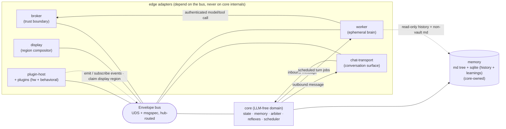
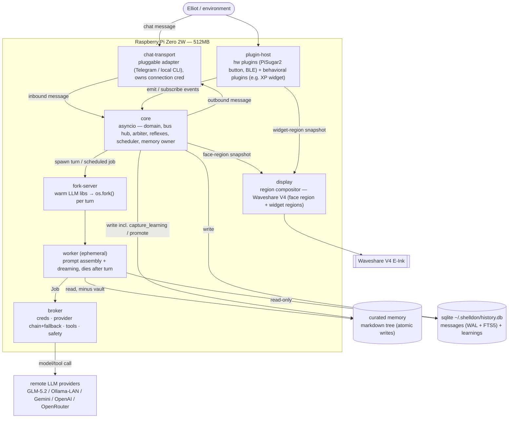

# Architecture Spine — shelldon (OpenClawGotchi v2)

> A consistency contract, not a design document. It fixes the **invariants** that keep the features
> built below it coherent. Structure is **seed** — the code owns the detail once it exists.
> Decisions, not rationale (that lives in `.memlog.md`).

## Design Paradigm

**Multi-process actor model over a typed message bus, around a hexagonal LLM-free core.**

Each long-lived process is an **actor** with a mailbox: `core`, `broker`, `chat-transport`, `display`, `plugin-host` — plus **ephemeral worker** actors forked per turn. shelldon is **chat-first**: the primary interaction is text conversation with the LLM brain over a **pluggable chat transport**; physical inputs are optional peripherals and the E-Ink screen is the pet's face. `core` is the hexagon's **domain center** (no LLM): it owns personality-state, memory, the arbiter, the resident reflexes, the **scheduler** (the autonomous mind — named multi-cadence jobs, AD-14), and hosts the bus. Everything else is an **edge adapter** — the brain (workers), the trust boundary (broker), the conversation surface (chat-transport), the screen (display), the senses + behavioral plugins (plugin-host). Edges reach the core *only* through the bus.

Namespace map: `core/` = domain (LLM-free, import-linter enforced; includes the scheduler) · `broker/` `worker/` `transport/` `display/` `plugins/` = adapters · `contracts/` = the shared msgspec envelope types.

## Invariants & Rules



### AD-1 — Hexagonal LLM-free core `[ADOPTED]`
- **Binds:** all; `core/`
- **Prevents:** the brain's concerns leaking into the soul; an un-auditable dependency on LLM libs in the always-on process.
- **Rule:** `core/` imports no LLM/provider modules; a CI import-linter fails the build if it does. Core holds state, memory ownership, the arbiter, reflexes, and the bus hub — nothing that calls a model.

### AD-2 — Broker is the sole trust boundary
- **Binds:** all; `CAP-5`, `CAP-8`
- **Prevents:** two owners of credentials; a prompt-injected worker reaching secrets or making arbitrary external calls.
- **Rule:** the broker is a **separate process** and the **only** holder of credentials + safety policy and the **only** egress to models/tools. It owns the ordered **provider chain with retry/fallback** (default GLM; alternates Ollama-LAN/Gemini/OpenAI/OpenRouter). No other process holds creds or calls a model/tool directly. `Job` envelopes carry no creds; the broker injects them internally. **Scope:** this rule governs **MODEL + TOOL credentials** (and their egress); a chat-transport adapter owns its **own connection credential** for its own surface (e.g. a bot token) and never touches model/tool creds (AD-13).

### AD-3 — Fork-server ephemeral workers
- **Binds:** all; `CAP-1`
- **Prevents:** v1's OOM (RAM accumulating across turns); cold-start per turn; creds leaking into the worker via COW.
- **Rule:** a fork-server parent pre-imports LLM **libs only** (never creds) and `os.fork()`s one worker per turn; the worker assembles the prompt with warm libs but proxies the authenticated call to the broker; the worker dies after its turn and its RAM is reclaimed. **At most one worker in flight** (see AD-9). Parent signals a **readiness barrier** before accepting the first turn. *Impl note:* COW pre-warming requires `gc.disable()` + `gc.freeze()` in the parent **before** `os.fork()`, else CPython refcount writes dirty the shared pages and the RAM win evaporates.

### AD-4 — The Envelope bus is the only seam
- **Binds:** all inter-component communication
- **Prevents:** incompatible message framing/addressing; ad-hoc point-to-point channels that ephemeral workers can't track.
- **Rule:** all cross-process comms are **versioned msgspec `Envelope`/`Job`/`Result`** over **Unix domain sockets** with a length-prefixed frame, **hub-routed through core**. Components address each other through the bus only — none reaches into another's internals. Workers are connect-do-die clients.

### AD-5 — Core is the sole writer of state and memory
- **Binds:** all; `CAP-2`, `CAP-6`
- **Prevents:** write races; an injected worker corrupting the soul or the memory store; divergent state across processes.
- **Rule:** only `core` mutates the personality-state struct, the markdown memory tree, **and the sqlite conversation store** (AD-6). Reflexes mutate state in-process. Workers **never** write — a `Result` envelope carries *proposed* changes, which core validates and applies; workers read the conversation store **read-only** (read-only sqlite handle). The state delta is a **sparse patch over fixed dotted paths** (e.g. `mood.valence`); memory-ops have **fixed arg schemas in `contracts/`** (`remember` / `rewrite_about` / `log_episode` / `capture_learning`, AD-6) — no free-text deltas. Display never reads shared memory; **core pushes a state snapshot** carrying a **monotonic `seq`**, and display **renders latest-wins**, dropping stale snapshots (tolerates slow E-Ink under reflex churn). The display is a **compositor of REGIONS**: **core owns the `face` region** (the pet's expression — state snapshots, monotonic `seq`, latest-wins, as above); **plugins may CLAIM widget regions** (e.g. a status-bar strip) and push to them over the bus (AD-8). Region ids are a **closed/registered type in `contracts/`** (not free strings — a typo can't silently mint a new region and slip past the check). Region claims are **arbitrated like GPIO/BLE claims** — **conflicting claims are rejected at load**, so **no two writers ever target one region**; each region keeps its own latest-wins snapshot stream.

### AD-6 — Memory is hybrid: sqlite conversation history + markdown curated tree
- **Binds:** `CAP-6`
- **Prevents:** a memory contract workers and core could implement incompatibly; reliance on a vector DB (spec non-goal); ordered/searchable chat history degrading into flat-file scans; uncontrolled SD-wear from high-churn writes.
- **Rule:** durable memory has **two layers, no vectors**:
  1. **Conversation history + learnings → sqlite** (one file, e.g. `~/.shelldon/history.db`). An ordered, timestamped **messages** store with **FTS5** keyword recall, **plus a `learnings` table** (raw, queryable capture of self-observations: `pattern_key` dedup, `recurrence_count`, `status` pending/promoted/pruned, `observation`, timestamps). On a normal turn a worker may propose a `capture_learning(observation, pattern_key?)` **memory-op** (hot path, cheap, **no extra LLM**); **core** (single-writer, AD-5) inserts or — on a matching `pattern_key` — increments `recurrence_count` and refreshes the row at `status=pending`. Single-owner now; the schema is shaped so an owner/`chat_id`/`user_id` key is a **non-breaking add** later (AD-13). sqlite runs in **WAL** mode with **batched commits** to bound write frequency.
  2. **Curated knowledge → markdown tree** (`about.md` rewritable, `INDEX.md`, `facts/`, category folders, `vault/`). Every markdown write is **atomic** (write-temp + `rename()`). `about.md` and the whole curated tree are **bot-owned**: core is sole writer (the LLM self-rewrites via memory-ops), and the owner does **not** hand-edit them.
  3. **Owner directive → `DIRECTIVE.md`** (human sole writer; the pet's owner-controlled "constitution"). The owner edits this file directly; the bot **reads it as authoritative** (injected into every prompt) but **never writes it** — it is not a memory-op target and not under core's write path. This is the disjoint-writer resolution to the dual-writer problem: the bot can fully rewrite *its own* `about.md`, while `DIRECTIVE.md` belongs solely to the owner. (Single-writer holds because the writer sets never overlap.)
  Retrieval = inject `DIRECTIVE.md` (authoritative, first) + `about.md` + the **recent conversation window (from sqlite)** + LLM `grep` over non-vault markdown / **FTS5** over history. Workers **read history read-only and read the markdown tree minus `vault/`**. `vault/` exclusion is **OS-enforced**, not a path-filter convention: workers run under a **less-privileged uid** than core/broker and `vault/` permissions exclude that uid, so a prompt-injected worker physically cannot read it. Surfacing `vault/` contents into a prompt is a **broker-gated** decision. The **dream cycle** (AD-15) is what turns raw `learnings` rows into durable knowledge: it classifies `pending` rows and **promotes** the durable/high-value ones into the curated markdown tree (`about.md`/`facts/`) — sensitive promotions go to `vault/` and are **broker-gated** — then **prunes** the rest. Division of labor: **sqlite = raw + queryable** (history + learnings); **markdown = curated + durable**. (This amends the earlier "no sqlite" rule: sqlite is now the conversation-history + learnings substrate; markdown remains the curated layer.)

### AD-7 — Volatile state lives in RAM, checkpointed
- **Binds:** `CAP-2`, `CAP-6`
- **Prevents:** high-frequency reflex/state churn wearing the SD card.
- **Rule:** the personality-state struct and the working window (recent-turn window + running summary) live in **RAM**, checkpointed periodically to **one small file**. The durable layers are: **curated memory → markdown tree** and **conversation history → sqlite** (AD-6); RAM state itself is never the source of truth for either.

### AD-8 — One generalized bus-only plugin model (hardware + behavioral)
- **Binds:** `CAP-3`, `CAP-7`
- **Prevents:** "add a sensor — or a behavior — without touching core" dying; a second, divergent plugin class for behaviors; a plugin reaching into core; per-plugin process sprawl on 512MB.
- **Rule:** **one plugin contract** covers BOTH hardware plugins (sensors/actuators) AND behavioral plugins (e.g. an XP/leveling widget) — there is **no separate behavioral class**. A single **plugin-host** process (renamed from peripheral-host) loads plugins as **modules** (discovered from a `plugins/` dir, each with a **manifest** declaring everything it touches: **emitted event kinds**, **subscribed broadcast event kinds** (`message-answered`, `tool-used`, `day-alive`, …), **GPIO/BLE resources claimed**, and **display regions claimed** (AD-5); the host **rejects conflicting claims** at load — two plugins claiming the same GPIO pin or the same display region is a load-time failure). A plugin may: **emit** event envelopes; **subscribe** to broadcast event kinds the bus fans out; own **PRIVATE plugin state** (its own, never core's soul/memory); and **claim a display region** to draw a widget. A plugin is a **bus client speaking only `Envelope`** and **never imports core** (it speaks the bus contract exclusively). BLE presence is **pair-first** — only previously-paired devices are tracked, **no promiscuous scanning** (pairing UX deferred). A crashed plugin kills its own sensing/behavior/widget, not the soul.

### AD-9 — The arbiter governs the brain
- **Binds:** `CAP-1`, `CAP-2`, `CAP-4`, `CAP-8`; `core/`
- **Prevents:** concurrent forks blowing RAM; a poke-stampede of queued turns; uncontrolled proactive spend; a failed call freezing the pet.
- **Rule:** a single arbiter in core decides reflex-vs-turn and governs turns: **≤1 worker turn in flight**; events during a turn **coalesce into a single pending catch-up slot** (the next turn folds in everything since it started — never a growing backlog of turns); proactive turns (CAP-4) are gated by a **minimum-interval cooldown**; on provider-chain exhaustion the arbiter **falls back to a reflex behavior** so the pet never freezes. **All turn-jobs (proactive pings + dreaming, AD-15) carry a cost** and are additionally gated by a **daily credit/turn BUDGET** and **battery-aware backoff** — the arbiter reads PiSugar2 power state (via the scheduler, AD-14) and **skips or defers non-essential LLM turns** on battery / low charge, livelier when plugged in. This gating is **consistent with the scheduler (AD-14)**: the scheduler proposes cadence-driven turn-jobs, the arbiter is the single gate that admits or drops them. The ≤1-worker bound is a **required M0 test** (see AD-10).

### AD-10 — Versioned typed contracts + tests from M0 `[ADOPTED]`
- **Binds:** all; `contracts/`
- **Prevents:** v1's zero-test drift; silent contract breaks across the bus.
- **Rule:** `Envelope`/`Job`/`Result` are **versioned** msgspec structs in `contracts/`; a test harness exists from the first milestone (M0). M0 tests **must** cover: contract round-trip (encode/decode every envelope), the **≤1-worker-in-flight** bound (AD-9), and **atomic-write crash-safety** (a write interrupted mid-`rename` leaves the prior tree intact, AD-6).

### AD-11 — Closed envelope header + two routing modes
- **Binds:** all bus traffic; `contracts/`
- **Prevents:** core / plugin-host / display each inventing a different addressing model (topic vs recipient vs kind); the new 1→many event subscriptions improvising an inconsistent fan-out.
- **Rule:** every `Envelope` has a **closed header** — `id`, `v` (schema version), `kind`, `src`, `dst`, `turn_id`. The hub supports exactly **two routing modes, both declared in `contracts/`**: (1) **point-to-point** — a static `kind`→destination table (the default); (2) **broadcast/subscription** — a closed set of `event` kinds (e.g. `message-answered`, `tool-used`, `day-alive`) that the hub **fans out to N subscribers**. The **subscription registry is built at load from plugin manifests** (AD-8) — no runtime self-registration of new kinds. No component invents its own routing or addressing.

### AD-12 — Turn identity & idempotent close
- **Binds:** `core/`, `worker/`; `CAP-1`, `CAP-8`
- **Prevents:** a late or zombie `Result` from a dead/superseded worker racing the reflex fallback or polluting the next turn.
- **Rule:** every turn carries a `turn_id`; core **fences** on it. A `Result` whose `turn_id` is already closed (timed out, superseded, or fallback-resolved) is **discarded**. Turn close is **idempotent**.

### AD-13 — Chat transport is a pluggable first-class adapter
- **Binds:** `CAP-1` (conversation surface concern); `transport/`, `contracts/`
- **Prevents:** hardcoding one transport (v1's baked-in Telegram); the conversation surface diverging per transport; a transport reaching into core internals or holding model/tool creds; a crash of the *primary* surface silently dropping the owner's messages or taking down the pet.
- **Rule:** the chat transport is a **first-class edge actor / bus client** (peer to broker and display) — it emits **inbound-message** envelopes to core and consumes **outbound-message** envelopes from core, speaking a **transport-agnostic message contract in `contracts/`**. **One adapter ships now** (single-owner; Telegram or local CLI); more (group chat, web interface, multi-user) are added as additional adapters **without core change**. The adapter holds its **own connection credential** (e.g. a bot token) for its own surface; the **broker remains the sole holder of MODEL + TOOL creds and sole model/tool egress** (AD-2 scope). An **owner** identity exists; the conversation schema (AD-6) is shaped so `chat_id`/`user_id` is a **non-breaking add**, so multi-user/group/web is **architected-for, not implemented**. The adapter is **supervised and auto-restarted** on crash; a transport failure **degrades to reflex-only** (pet stays alive, conversation paused) and **never crashes core** — same graceful-degradation contract as a peripheral (AD-8) and a dead provider chain (AD-9). Per-transport **message-delivery / reconnect guarantees** (e.g. replaying missed updates) are adapter-specific and **deferred** to the adapter's story.

### AD-14 — Scheduler: the autonomous mind (multi-cadence, cost/battery-aware)
- **Binds:** `CAP-10`; `core/`
- **Prevents:** v1's single-tick coarseness (one heartbeat could not express different cadences); AND unbounded background CPU/LLM/battery spend from a mind that wakes itself up.
- **Rule:** a **core-resident scheduler** owns the pet's self-driven life as **named jobs**, each with its own **cadence** — `interval`, `cron`-style, or `idle-triggered` — replacing v1's single heartbeat (**"heartbeat" is now just one job**). Every job is tagged by **COST TIER**: **reflex jobs** (mood drift, blink) run **in-core, no LLM, cheap CPU**; **turn jobs** (reflection, dreaming AD-15, proactive pings) each cost a **fork+LLM**, are **few**, **cooldown-gated**, and draw on a **daily credit/turn BUDGET** (AD-9). The scheduler is **BATTERY-AWARE**: it reads **PiSugar2** power state and **stretches cadences / skips non-essential LLM turns** on battery or low charge, and runs **livelier when plugged in**. **Incoming messages/events bypass the scheduler** entirely (immediate, not cadence-driven). Scheduler-proposed turn jobs go through the **arbiter** (AD-9) — same ≤1-worker bound, coalescing, and credit/battery gate as every other turn; the scheduler never forks directly.

### AD-15 — Dreaming & learning consolidation
- **Binds:** `CAP-6`, `CAP-11`
- **Prevents:** unbounded memory growth; captured learnings sitting in sqlite forever and never becoming durable; a separate non-reusing "consolidation subsystem" duplicating the worker/broker/arbiter machinery.
- **Rule:** **dreaming is a scheduled introspective WORKER TURN** (triggered by **idle / context-pressure / cadence**, AD-14) — **not a separate subsystem**: it **reuses the fork-server, broker, and arbiter** exactly like a normal turn. In one dream turn the worker (1) **consolidates** recent conversation history (summarize/compact the working window), (2) **classifies the `pending` `learnings`** (AD-6) and **promotes** the durable/high-value ones — the LLM judges by **impact + recurrence**, **not a rigid count** — into curated markdown (`about.md`/`facts/`), routing sensitive ones to `vault/` (**broker-gated**), and (3) **prunes** the rest. As with every turn, the worker only **proposes** memory-ops in its `Result`; **core is the single writer** (AD-5) that applies promotions/prunes. **LIGHT scope:** no ERRORS/FEATURE_REQUESTS taxonomy, no CLAUDE.md/skill promotion, no copy of v1's machinery.

## Consistency Conventions

| Concern | Convention |
| --- | --- |
| Naming | Actors are processes named for their role (`core`/`broker`/`worker`/`chat-transport`/`display`/`plugin-host`); envelope types are `Envelope`/`Job`/`Result` plus the transport-agnostic inbound/outbound message contract; memory-ops are verbs (`remember`, `rewrite_about`, `log_episode`, `capture_learning`); scheduler jobs are named (`heartbeat`, `mood-drift`, `dream`, …). |
| Plugins & claims | One plugin contract for hardware AND behavioral plugins (AD-8); a manifest declares all claimed resources — **GPIO/BLE pins**, **display regions** (AD-5), **emitted event kinds**, and **subscribed broadcast event kinds**; plugin-host **rejects conflicting claims at load** (one writer per GPIO pin, one writer per display region); plugins own **private state** and **never import core**, speaking only `Envelope`. |
| Data & formats | msgspec structs; UDS frames are 4-byte big-endian length + msgspec bytes; closed envelope header `id/v/kind/src/dst/turn_id` (AD-11); state deltas are sparse patches over fixed dotted paths; snapshots carry monotonic `seq`; timestamps ISO-8601 UTC; **no credentials ever on the bus**. |
| State & cross-cutting | One writer (core) for state + memory incl. the sqlite store — conversation history **and** the `learnings` table (workers read history read-only); atomic markdown writes (temp+rename); sqlite WAL + batched commits; `vault/` OS-unreadable to the worker uid; errors surface as `Result` with an error variant (never an exception across the bus); a turn failure degrades to reflex, never blocks; turns are fenced by `turn_id` with idempotent close (AD-12); config + secrets resolve only inside the broker. |
| Cost & cadence | The scheduler (AD-14) runs named multi-cadence jobs tagged by **cost tier** — reflex jobs are in-core/no-LLM; turn jobs (incl. dreaming + proactive) cost a fork+LLM and are gated by a **daily credit/turn budget** + **PiSugar2 battery-aware backoff** (AD-9); incoming messages/events bypass the scheduler (immediate). |

## Structural Seed



```text
shelldon/
  core/          # LLM-free (import-linter enforced): bus/ arbiter/ scheduler/ reflexes/ state/ memory/(owner)
  broker/        # separate process: creds, provider chain+fallback, tool exec, safety policy
  worker/        # fork-server parent + per-turn worker (LLM provider libs here); normal turns + dream turns (AD-15)
  transport/     # chat-transport adapters (Telegram / local CLI); bus clients, own connection cred (AD-13)
  display/       # region compositor — Waveshare V4 renderer; core owns face region, plugins claim widget regions (AD-5)
  plugins/       # plugin-host + plugins/  (one contract, hw + behavioral; each plugin: manifest + module)  [renamed from peripherals/]
  contracts/     # versioned msgspec Envelope/Job/Result + transport-agnostic message contract
  tests/         # harness from M0
  # runtime memory lives OUTSIDE source:
  #   curated md tree  ~/.shelldon/memory/about.md INDEX.md people/ episodes/ facts/ vault/   (people/ = people the OWNER mentions, not BLE-detected)
  #   sqlite store     ~/.shelldon/history.db   (messages: WAL + FTS5; learnings table: pattern_key/recurrence_count/status; single-owner now)
```

**Component-local deps (resolved at install against the real hardware, not spine invariants):** Waveshare V4 E-Ink driver (vendored Waveshare module or `omni-epd`) + `spidev` in `display/`; PiSugar2 power/button over its local HTTP/socket API in `plugins/` (power state also read by the scheduler, AD-14); per-provider LLM SDKs inside `broker/` (default GLM-5.2 via the Z.ai OpenAI/Anthropic-compatible endpoint). Pin these in each component's own manifest when the hardware is in hand.

## Capability → Architecture Map

| Capability | Lives in | Governed by |
| --- | --- | --- |
| CAP-1 LLM response to interaction | chat-transport ↔ core; fork-server → worker → broker; arbiter | AD-13, AD-3, AD-2, AD-9, AD-11, AD-12 |
| CAP-2 Aliveness / resident reflexes | core reflexes + personality-state | AD-1, AD-5, AD-9 |
| CAP-3 Physical sensing (optional peripheral plugins) | plugin-host plugins (button, BLE) | AD-8 |
| CAP-4 Proactive action | arbiter (cooldown + credit/battery-gated proactive turns); scheduler proposes | AD-9, AD-14 |
| CAP-5 Single capability broker | broker process | AD-2, AD-4, AD-11 |
| CAP-6 Cross-turn memory | core-owned hybrid memory: sqlite (history + learnings) + markdown curated tree | AD-5, AD-6, AD-7, AD-15 |
| CAP-7 Pluggable plugins (hardware + behavioral) | plugin-host + one bus-only plugin contract (events, subscriptions, private state, display regions) | AD-8, AD-5 |
| CAP-8 LLM fallback on error | broker provider chain + arbiter degradation | AD-2, AD-9 |
| CAP-9 Display compositor (face + widget regions) | display region compositor; core owns face, plugins claim widgets | AD-5, AD-8 |
| CAP-10 Autonomous mind / scheduling | core scheduler — named multi-cadence jobs, cost-tiered, battery/credit-aware | AD-14, AD-9 |
| CAP-11 Self-improving learning + dreaming | hot-path `capture_learning` → sqlite; dream turn classifies/promotes/prunes | AD-15, AD-6 |

## Deferred

- **Additional transport adapters** (group chat, web interface, multi-user keying) — **architected, not implemented**; added as new `transport/` adapters with a non-breaking `chat_id`/`user_id` schema add, no core change (AD-13).
- **FTS5 keyword recall** — now **in use** for conversation history (AD-6), no longer just an escape hatch; tuning the recall query/ranking is runtime detail, not a spine invariant.
- **Memory folder categories** — runtime owns them; split an index when it grows. Not fixed here.
- **XP / leveling** — an **optional example plugin** on the generalized contract (subscribes to broadcast events, owns its own XP/level state, draws a status-bar widget in a claimed display region) — **full v1 parity, zero core changes** (AD-8 + AD-5). Mentioned as proof the contract is general, not its own AD.
- **Bounded worker pool (N>1)** — stay at ≤1 in flight; revisit only if turns prove too bursty (AD-3/AD-9).
- **Specific plugins beyond PiSugar2 + BLE + the XP example** — the AD-8 contract absorbs them (hardware or behavioral); no new invariant.
- **Reflex / scheduler job catalogue** (which jobs exist, exact cadences, the credit-budget number, battery thresholds) — story-time / runtime config, not spine invariants (AD-14/AD-9).
- **Learning promotion heuristics** (the LLM's impact+recurrence judgment thresholds) — runtime detail of the dream turn, not a fixed invariant (AD-15).
- **Exact LLM model id + per-provider config** — broker config, not spine (default GLM-5.2 via Z.ai compatible endpoint).
- **Reflex catalogue** (which reflexes exist) and **BLE pairing UX flow** — story-time detail; pair-first already decided at spec level.
- **Sound-out / always-on audio** — spec non-goals (deferred).
